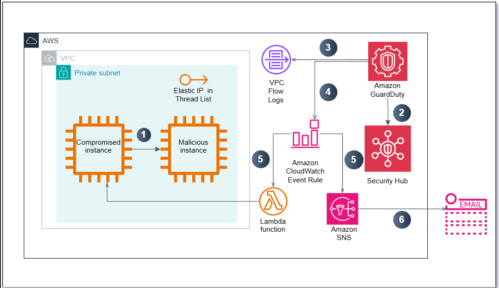
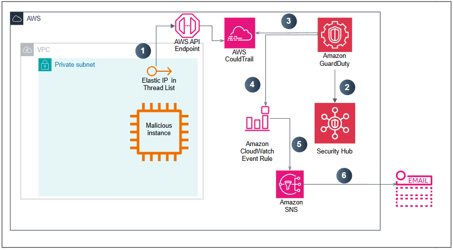
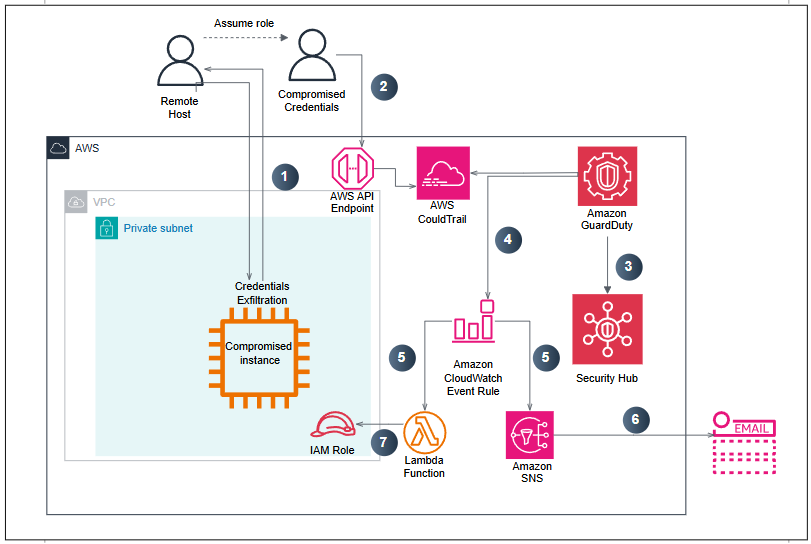

## 1. Giới thiệu

 Trong bài workshop này, các bạn sẽ được tìm hiểu về **Amazon GuardDuty** kết hợp với **AWS Security Hub**. 
 Amazon GuardDuty là một dịch vụ có chức năng phát hiện các mối đe dọa đến hệ thống và khắc phục chúng, 
 trong khi AWS Security Hub sẽ cung cấp cho chúng ta cái nhìn toàn diện về các cảnh báo bảo mật ưu tiên và 
 trạng thái tuân thủ trên các tài khoản AWS. Chúng ta sẽ cùng nhau phân tích, đánh giá và làm thế nào để báo động 
 cũng như khắc phục các vấn đề bảo mật dựa trên các "Findings" của GuardDuty và Security Hub.

 ### Về GuardDuty
 **Nguồn dữ liệu**
 Kể từ khi được kích hoạt trên một AWS Region, GuardDuty sẽ tiến hành phân tích mọi dữ liệu đến từ:
 1. VPC Flow Logs
 2. CloudTrail Logs
 3. DNS Logs
    - Nhật ký lưu trữ của DNS xuất phát từ các DNS resolvers (sở hữu bởi AWS) dành cho các VPC và không thể truy xuất trực tiếp từ phía người dùng.
    - Nếu như DNS resolver được cấu hình độc lập bởi chính bạn hoặc từ phía bên thứ 3, GuardDuty sẽ không thể truy xuất, xử lý và xác định các mối nguy hại từ nguồn dữ liệu này.
    
     

GuardDuty có thể truy xuất đến mọi nguồn dữ liệu (được đề cập ở trên) cho dù chúng chưa được kích hoạt từ trước.

Bạn nên kích hoạt đồng thời CloudTrail Logs và VPC Flow Logs để có cái nhìn tổng quan và chi tiết nhất khi tiến hành phân tích dữ liệu.

GuardDuty là một dịch vụ mang tính chất Regional, thế nên để có thể theo dõi dữ liệu ở một AWS Region thì bạn phải kích hoạt ở AWS Region đó.

Bạn có thể kích hoạt thông qua AWS Console hoặc sử dụng APIs. Đa số người dùng sẽ kích hoạt ở mọi AWS Regions và AWS Accounts một cách đồng thời thông qua APIs.

Dù bạn có số lượng các tài nguyên AWS ít hay nhiều (ví dụ như VPCs hay IAM users), GuardDuty sẽ không gây bất kỳ ảnh hưởng nào đến bất kỳ tài nguyên nào bởi các quy trình xử lý sẽ chỉ được thực hiện nội bộ bên trong dịch vụ GuardDuty.

GuardDuty là một dịch vụ được quản lý hoàn toàn bởi AWS.

Cách tính giá của GuardDuty sẽ dựa trên
- Số lượng CloudTrail events được phân tích.
- Khối lượng của VPC floư logs (theo GB).
- Khối lượng của DNS log (theo GB).

Mỗi tài khoản AWS sẽ có 30 ngày thử nghiệm ở mỗi AWS Region, điều này sẽ giúp GuardDuty dễ dàng dự đoán chi phí phát sinh.

### Findings
GuardDuty sẽ chủ động quan sát và theo dõi các dấu hiệu bất thường xuất phát từ:
- 3 nguồn dữ liệu (được đề cập ở trên).
- Các EC2 Instances.
- Các tài nguyên AWS IAM.
Bạn sẽ dễ dàng truy xuất chi tiết các Findings được phát hiện bởi GuardDuty ở thanh Findings. Mỗi Finding sẽ được chia nhỏ thành nhiều thông tin theo định dạng mà cho phép chúng ta dễ dàng đọc hiểu và xử lý các nguy cơ về bảo mật.

Tìm hiểu chi tiết hơn về danh sách của toàn bộ các loạt GuardDuty Findings tại [đây](https://docs.aws.amazon.com/guardduty/latest/ug/guardduty_finding-format.html)

### Về AWS Security Hub
AWS Security Hub cung cấp cho bạn cái nhìn toàn diện về các cảnh báo bảo mật ưu tiên cao và trạng thái tuân thủ trên các tài khoản AW.

Sẽ có rất nhiều các công cụ bảo mật mạnh mẽ để bạn sử dụng, từ tường lửa hay ứng dụng bảo vệ endpoint đến các ứng dụng quét lỗ hổng và sự tuân thủ bảo mật. Nhưng đôi khi, điều này khiến đội ngũ của bạn phải chuyển đổi qua lại giữa các công cụ này để đối phó với hàng trăm, hàng nghìn cảnh báo bảo mật mỗi ngày. Với Security Hub, giờ đây bạn có một nơi tổng hợp duy nhất, sắp xếp và phân độ ưu tiên các cảnh báo hoặc phát hiện bảo mật từ nhiều dịch vụ AWS (như Amazon GuardDuty, Amazon Inspector và Amazon Macie) hay từ các giải pháp cung cấp bởi đối tác của AWS.

Các rủi ro được tìm thấy sẽ được tóm tắt trực quan trên trang tổng quan tích hợp với các biểu đồ và bảng mà bạn có thể tương tác. Bạn cũng có thể giám sát hệ thống của bạn liên tục bằng cách sử dụng chức năng kiểm tra tự động sự tuân thủ so với các thực nghiệm tối ưu từ AWS và các tiêu chuẩn trên thị trường mà doanh nghiệp của bạn đang tuân theo.

### Chi phí
Thông thường, chi phí sẽ ít hơn $1 mỗi tháng nếu tài khoản của bạn chỉ sử dụng cho mục đích thử nghiệm, luyện tập và không thực hiện những cuộc tấn công giả lập.
**Kiểm tra bảo mật**
- 100,000 lần đầu tiên => $0.0010/check.
- 100,001 – 500,000 => $0.0008/check.
- 500,001+ => $0.0005/check.
  
**Tìm các sự kiện tấn công**
- 10,000 lần đầu tiên => miễn phí.
- 10,001+ => $0.00003/lần.

### So sánh Amazon GuardDuty và AWS Security Hub

| Tiêu chí                  | Amazon GuardDuty                                                                 | AWS Security Hub                                                              |
|---------------------------|----------------------------------------------------------------------------------|-------------------------------------------------------------------------------|
| **Mục đích chính**        | Phát hiện mối đe dọa tự động dựa trên hành vi và machine learning               | Tổng hợp, chuẩn hóa và đánh giá các cảnh báo bảo mật từ nhiều nguồn          |
| **Dữ liệu xử lý**         | VPC Flow Logs, CloudTrail Events, DNS logs                                       | Cảnh báo từ GuardDuty, Inspector, IAM Access Analyzer,...                    |
| **Cách hoạt động**        | Phân tích log, sử dụng AI và threat intel để phát hiện bất thường               | Thu thập và chuẩn hóa cảnh báo theo chuẩn ASFF                               |
| **Phản ứng sự kiện**      | Gửi cảnh báo đến CloudWatch, kích hoạt Lambda                                    | Cho phép tạo Custom Actions, tích hợp với Lambda, EventBridge                |
| **Chuẩn cảnh báo**        | Định dạng nội bộ riêng                                                            | AWS Security Finding Format (ASFF)                                           |
| **Ưu điểm**               |  Không cần cài agent, phát hiện real-time, tự động                      |  Tổng hợp toàn diện, tích hợp nhiều nguồn, hỗ trợ Best Practice     |
| **Nhược điểm**            |  Không có báo cáo tổng hợp, có thể tạo cảnh báo giả                         |  Phụ thuộc vào nguồn cảnh báo khác, có thể quá tải thông tin            |

> Có thể **kết hợp cả hai**: sử dụng GuardDuty để phát hiện mối đe dọa, sau đó gửi findings về Security Hub để tổng hợp, đánh giá và phản ứng.

## 2. Các bước chuẩn bị

### 2.1 Kích hoạt GuardDuty
1. Đăng nhập vào AWS Console, truy cập vào dịch vụ [GuardDuty](https://ap-southeast-1.console.aws.amazon.com/guardduty/home?region=ap-southeast-1#/).
2. Bắt đầu bằng cách chọn **Get started**.
   

3. Đối với tài khoản mới, AWS sẽ cho chúng ta 30 ngày dùng thử, để bắt đầu sử dụng, nhấn chọn nút 
**Enable GuardDuty**.

 
Sau khi kích hoạt GuardDuty xong, chúng ta sẽ tiến hành kích hoạt thêm Security Hub.

### 2.2 Kích hoạt Security Hub

Trong bước này chúng ta sẽ tiến hành kích hoạt Security Hub để người dùng có cái nhìn tổng quan hơn về các cảnh báo bảo mật.

1. Đăng nhập vào AWS Console.
2. Truy cập vào [Giao diện quản trị dịch vụ AWS Security Hub](https://ap-southeast-1.console.aws.amazon.com/securityhub/home?region=ap-southeast-1#/landing).
3. Chọn **Security Hub CSPM**, sau đó click **Get started**.
   

4. Tại trang **Enable AWS Security Hub CSPM**, chọn các tiêu chuẩn về bảo mật (Security standards) như là AWS Foundational Security Best Practices, CIS AWS Foundations Benchmark, và PCI DSS.
   

5. Chọn **Enable Security Hub**.
6. Sau khi kích hoạt, bạn sẽ cần chờ một khoản thời gian để Security Hub đánh giá Security Score của tài khoản hiện tại của bạn so với từng bộ tiêu chuẩn bảo mật mà bạn thiết lập.

### 2.3 Tạo Stack

Trong bước này chúng ta sẽ tiến hành tạo Stack để theo dõi và ngăn chặn các cuộc tấn công thông qua ***Findings*** trên GuardDuty.

1. Đăng nhập vào AWS Console.
2. Truy cập vào [Giao diện quản trị dịch vụ CloudFormation](https://ap-southeast-1.console.aws.amazon.com.cloudformation/home?region=ap-southeast-1).
3. Tiến hành tạo Stack mới bằng việc ấn nút **Create stack**.
   

4. Ở trang Specify template, click vào Upload a template file.

Tải file template tại [đây](https://github.com/AWS-First-Cloud-Journey/GuardDuty-Hands-On/archive/refs/heads/main.zip)

5. Ở trang Paraments, chúng ta sẽ nhập một số thông tin bắt buộc sau:
+ **Email Address**: Địa chỉ email của bạn. Click **Next**.

6. Ở trang Specify Stack Details, ấn **Next**.
7. Ở trang Configure stack options, ấn **Next**.
8. Ở trang Capabilities, tiến hành chấp nhận (Acknowledge) cho phép Template tạo các IAM role, cuối cùng chọn nút **Create Stack**.

9. Kiểm tra lại các thông tin, ấn **Submit**.
    

 
Quá trình trên sẽ diễn ra trong vòng 5-10 phút cho tới khi chúng ta thấy được trạng thái của Stack là CREATE_COMPLETE. Sau đó, chúng ta sẽ nhận được một thông báo qua Email với chủ đề tương tự AWS Notification - Subscription Confirmation.
 

### Các tài nguyên được chuẩn bị
1. Dịch vụ EC2:
- 2 instances với tên gọi là Compromised Instance.
- 1 instance với tên gọi là Malicious Instance.
2. Dịch vụ IAM:
- 1 IAM Role dành cho EC2 instance với quyền hạn truy cập đến SSM Parameter Store và DynamoDB.
3. Dịch vụ SNS:
-  1 SNS Topic gửi thông báo qua E-mail.
4. Dịch vụ EventBridge:
- 3 EventBridge Events Rules cho việc kích hoạt các thông báo và quá trình khắc phục.
5. Dịch vụ Lambda:
- 2 Lambda Functions tiến hành khắc phục các lỗ hổng.
6. Dịch vụ SSM:
- 1 SSM Parameter Store dùng để chứa mật khẩu cho môi trường TESTING.

## 3. Mô phỏng các cuộc tấn công
Trong bước này, chúng ta sẽ quan sát và thực hiện các giao thức bảo mật cần thiết với
3 tình huống mô phỏng các cuộc tấn công. Từ đó sẽ thấy được các cảnh báo bảo mật trên
Security Hub và GuardDuty sẽ chủ động ngăn chặn các cuộc tấn công thông qua các tài nguyên đã được chuẩn bị từ trước (Lambda function, EventBridge Rules, SNS Topic,...).

### 3.1 Compromised EC2 Instance
### Tình huống 1
Vào một buổi sáng thứ 2, bạn Long đến văn phòng sớm, chuẩn bị một tách cà phê, 
ngồi vào chỗ và mở laptop, bắt đầu các công việc hằng ngày như gửi E-mail, viết kế hoạch. Đột nhiên, 
bạn Long bắt đầu nhận một chuỗi những E-mails với nội dung liên quan đến 
sự phát hiện mới nhất đối với các mối nguy hại, điều mà bạn Long chưa từng thấy trước đây, 
tuy nhiên bạn Long bắt đầu tìm hiểu và điều tra ngay lập tức. Điều đáng mừng là đồng nghiệp của bạn, 
Việt đã thiết lập những phản ứng tự động dành cho những Findings ấy thế nên chúng đã được giải quyết tức.

*Vậy những phản ứng tự động Việt đã thiết lập là những phản ứng nào?*

Nội dung E-mail đầu tiên mà bạn Long được nhận được với việc EC2 instance của bạn có thể đã bị xâm nhập như sau:

Nội dung E-mail thứ hai ngay sau đó mà bạn nhận được với tình hình đã được giải quyết tức thì như sau:

### Kiến trúc tổng quan

 

1. Một EC2 compromised instance, tiến hành gửi gói tin pings đến địa chỉ EIP của một EC2 instance nguy hại. Địa chỉ EIP đó đã được thêm ở Custom Threat List.
2. Security Hub phát hiện ra lỗ hổng bảo mật bất thường.
3. GuardDuty tiến hành theo dõi VPC Flow Logs (kể cả CloudTrail và DNS Logs) và phân tích tình hình dựa trên Machine Learning, Custom Threat List và một số cở sở khác.
4. GuardDuty sinh ra một Finding và hiển thị trên GuardDuty Console và gửi sự kiện này đến EventBridge Events.
5. Dựa trên sự kiện này, EventBridge Event Rule tiến hành phản ứng và kích hoạt đồng thời SNS Topic và Lambda Function tương ứng.
6. SNS Topic sẽ gửi E-mail cùng với chi tiết Finding cho bạn.
7. Lambda Function sẽ tiến hành cô lập EC2 compromised instance.

> Khi Việt thiết lập thông báo E-mail cho sự kiện này, anh ấy chỉ thêm một vài thông tin nhất định về Finding ấy và cấu hình Lambda Function để tự động cô lập EC2 compromised instance. Mặc dù Finding đã được giải quyết, bạn vẫn quyết định tìm hiểu chi tiết hơn về các thiết lập và cấu hình hiện tại này của Việt.

### Quá trình điều tra
Mặc dù bạn có thể thấy các Findings này từ GuardDuty Console, đa số các khách hàng đều muốn tập hợp chúng, từ các AWS Regions và AWS Accounts, đến một hệ thống quản lý dữ liệu bảo mật tập trung (**SIEM**) để tiến hành phân tích và thực hiện quá trình Remediations. Cách tiếp cận thông dụng nhất là cấu hình GuardDuty dưới một mô hình Admin/Member và sử dụng quy trình kết hợp giữa EventBridge Event Rules và Lambda Function để tiến hành đẩy những Findings này tới **SIEM** hoặc một **Centralized Logging Framework**. Ngoài ra còn có một số giải pháp đến từ các đối tác của AWS, giúp khách hàng thực hiện các tác vụ hợp nhất và đẩy dữ liệu dễ dàng nhất.

1. Truy cập  vào [Security Hub](https://ap-southeast-1.console.aws.amazon.com/securityhub/home?region=ap-southeast-1#/) ở ap-southeast-1.

2. Chúng ta sẽ thấy được các cảnh báo bảo mật ở GuardDuty với Finding: **UnauthorizedAccess:EC2/MaliciousIPCaller.Custom**.

3. Tiến hành truy cập vào GuardDuty Console ở ap-southeast-1.

4. Chúng ta sẽ thấy được một Finding với định dạng như sau **UnauthorizedAccess:EC2/MaliciousIPCaller.Custom**.
   

5. Nếu không có Finding nào, vui lòng ấn refresh và đợi.

> Người dùng có thể truy xuất các Findings ở GuardDuty console trong vòng 90 ngày.

6. Trong môi trường của bạn, kiểu Finding này chỉ ra rằng một EC2 instance đang thực hiện quá trình giao tiếp tới địa chỉ IP (đã được thêm vào Threat Lists).
7. Tiến hành chọn Lists ở thanh điều hướng (bên tay trái) để có thể xem Threat List mà Việt đã thêm trước đây **Example-Threat-List**.
   

> GuardDuty sử dụng những hệ thống Threat Intelligence được cung cấp bởi đội ngũ AWS Security và bên thứ 3 như ProofPoint và CrowdStike. Bạn có thể mở rộng tầm quan sát của GuardDuty bằng cách tự cấu hình danh sách IP đáng tin cậy (Trusted IP Lists) và danh sách các mối nguy hại (Threat Lists). Nếu bạn đã thiết lập GuardDuty theo cấu trúc Admin/Member, từ tài khoản GuardDuty Admin, bạn có thể quản lý các danh sách trên và để các tài khoản Members kế thừa. Mặc nhiên, các tài khoản Members sẽ không quyền chỉnh sửa các danh sách này.

 
Trong tình huống giả lập này, EC2 compromised instance chỉ tiến hành truy cập đến EIP của một EC2 instance khác trong cùng VPC nhằm nội bộ hoá quá trình giả lập cùng luồng xử lý dữ liệu chỉ xảy ra trong môi trường của bạn. CloudFormation Template sẽ tự động tạo danh sách mối nguy hại (Threat Lists) và gán địa chỉ EIP này vào đó.
 

**Kiểm tra EventBridge Event Rule**
Việt sử dụng EventBridge Event Rules để gửi thông báo đến bạn về các Findings cùng với nội dung các bước của quá trình Remediations. Chúng ta sẽ tiến hành khảo sát chi tiết hơn để hiểu rõ Việt đã thiết lập những gì và quá trình này diễn ra như thế nào?
1. Truy cập vào [EventBridge](https://ap-southeast-1.console.aws.amazon.com/events/home?region=ap-southeast-1#/) Console ở ap-southeast-1.
   

3. Ở thanh điều hướng bên tay trái, dưới **Events**, chọn **Rules**. Bạn sẽ thấy có 3 quy tắc đã được thiết lập (bởi CloudFormation Template), bắt đầu với tiền tố có dạng sau *GuardDuty-Event*.

4. Tiến hành chọn quy tắc có tên là **GuardDuty-Event-EC2-MaliciousIPCaller**.
   

6. Bạn sẽ dễ dàng nhận thấy có 2 mục tiêu tại vùng Targets.
- **Lambda Function**
- **SNS Topic**: Tiến hành gửi thông báo E-mail cho bạn dựa trên dữ liệu được cung cấp bởi **EventBridge Event Rule**. Thay vì toàn bộ dữ liệu JSON được sử dụng, bằng việc sử dụng **Input Transformer**, Việt đã tuỳ chỉnh nội dung thông báo.
  

**Kiểm tra quá trình Remediation dựa trên Lambda Function**

Lambda Function là chìa khoá nắm giữ logic nhằm thực hiện các bước của quá trình Remediations dành cho các Findings. Việt đã thiết lập Lambda Function nhằm loại bỏ và thay thế Security Group của EC2 compromised instance bằng một Security Group **không chứa bất kỳ một quy tắc Ingress/Egress nào**. Điều này sẽ giúp **cô lập EC2 compromised instance ra khỏi hệ thống mạng hiện tại**.

*Để tiến hành kiểm tra quá trình Remediation:*
1. Từ quy tắc *GuardDuty-Event-EC2-MaliciousIPCaller*, tại vùng **Targets**, ở mục **Type** là Lambda Function, chúng ta tìm kiếm **Resource Name** tương ứng.
2. Tại Lambda Function console, tìm kiếm **Resource Name** theo bước trước.

3. Chúng ta có thể xem xét một số mục
- Configuration
  + Tại thanh Designer, chúng ta sẽ dễ dàng thấy mối quan hệ với EventBridge Event Rule.
  + Ở phần Function code, những logic về coding sẽ được thực thi tại đây.
- Permissions
- Monitoring
  

**Xác nhận quá trình Remediation đã thành công**
Để đảm bảo kết quả của quá trình Remediation, chúng ta cần phải xem xét EC2 instance đã bị cô lập hay chưa. Tại thời điểm này, bạn đã nhận được một E-mail cùng với một số thông tin quan trọng.
1. Truy cập vào EC2 console ở ap-southeast-1 tại [đây](https://ap-southeast-1.console.aws.amazon.com/ec2/home?region=ap-southeast-1#Overview:).
   

2. Chọn **Instances**, chúng sẽ thấy được 3 EC2 instance với tiền tố bắt đầu với định dạng sau *GuardDuty-Example*.

3. Dựa trên **instance ID** có từ GuardDuty Finding hay thông báo E-mail, chúng ta chọn EC2 instance tương ứng: *GuardDuty-Example: Compromised Instance: Scenario 1*.
   

4. Sau khi quá trình Remediation hoàn thành, chúng ta sẽ kiểm tra **Security Group** của EC2 compromised instance này, sẽ có định dạng tên tương tự sau **ForensicSecurityGroup**.
5. **ForensicSecurityGroup** sẽ không có bất kỳ một quy tắc Ingress/Egress nào chứa địa chỉ IP trong **Example-Threat-List**.

### 3.2 Compromised IAM credentials
### Tình huống 2: Compromised IAM credentials
Bạn Long đã hoàn thành tình huống giả lập tấn công đầu tiên và quay trở lại với tách cà phê của mình. Tuy nhiên, bạn Long lại tiếp tục nhận thêm những thông báo mới về những Findings liên quan tới các dịch vụ AWS IAM. Nội dung thông báo đầu tiên chỉ ra rằng, bằng cách sử dụng **IAM credentials**, một số **API calls** đã được thực hiện từ địa chỉ IP đã được thêm vào **Threat List** (ở bài trước).

 
> Không có bất kỳ IAM credentials cá nhân nào đã từng bị phơi bày hay lộ ra dưới bất kỳ hình thức nào.
 
### Kiến trúc tổng quan

1. **EC2-malicious** instance này tiến hành thực hiện các **API calls**, EIP của instance này đã được thêm vào **Threat List**. Nội dung các API calls đã được lưu lại trong nhật ký của CloudTrail.
2. **Security Hub** phát hiện các hành động đáng ngờ được phát hiện bởi GuardDuty
3. **GuardDuty** quan sát nhật ký của **CloudTrail Logs** cùng với **VPC Flow Logs** và **DNS Logs**, qua đó đánh giá tình hình dựa trên một số cơ sở nhất định.
3. GuardDuty tạo ra những Findings tương ứng và đồng thời gửi chi tiết đến **GuardDuty Console** và **EventBridge Events**.
4. **EventBridge Event Rule** tiến hành kích hoạt **SNS Topic**.
5. **SNS Topic** tiến hành gửi thông báo E-mail cùng với thông tin liên quan.

### Quá trình điều tra
Để tiến hành xem xét các Findings:
1. Truy cập Security Hub, chúng ta phát hiện ra lỗ hổng bảo mật được phát hiện bởi GuardDuty.
   

2. Truy cập vào GuardDuty Console ở **ap-southeast-1** tại [đây](https://ap-southeast-1.console.aws.amazon.com/guardduty/home?region=ap-southeast-1#/).
3. Chúng ta sẽ thấy được các Findings với định dạng như sau.
- Recon:IAMUser
- UnauthorizedAccess:IAMUser.

4. Nếu không có bất kỳ Finding nào, tiến hành nhấn nút Refresh và đợi.
5. Từ Finding **Recon:IAMUser/MaliciousIPCaller.Custom**, chúng ta có thể dễ dàng truy xuất một số thông tin sau:
- Chuyện gì đã xảy ra?
- Tài nguyên AWS nào bị ảnh hưởng?
- Sự kiện này xảy ra khi nào?
6. Ở dưới phần **Resource Affected**, bạn sẽ kiếm được User Name mà liên quan đến Finding này.
  

Finding này chỉ ra rằng **IAM credential** của **User Name** trên đã có thể bị phơi bày bởi những **API calls** xuất phát từ địa chỉ IP mà trước đó đã được thêm vào **Threat List**.

> Vậy những hành động nào đã được IAM User này thực hiện?

Ở mục **Action**, chúng ta thấy được hành động **DescribeParameters** đã được thực hiện.

> Làm thế nào để chúng ta có thể thấy được hết các hành động còn lại, được thực hiện bởi IAM User này, trong vòng 1 tiếng trước hay 1 ngày truớc?

GuardDuty có khả năng phân tích một lượng lớn dữ liệu nhằm xác định chính xác mối nguy hiểm có mặt trong môi trường của bạn. Tuy nhiên, trong quá trình điều tra và các bước thực hiện Remediation, chúng ta cũng cần kết hợp nhiều nguồn dữ liệu khác nhau để có một cái nhìn tương quan nhất có thể.

Trong trường hợp này, nhà phân tích có thể sử dụng các thông tin chi tiết có thể tìm thấy trong nhật ký hành vi người dùng thông qua **CloudTrail**.

 
Những Findings về IAM được sinh ra bởi EC2 malicious instance đã thực hiện những API calls và EIP của instance này nằm trong Custom Threat List.
 

**Kiểm tra EventBridge Event Rule**
1. Truy cập vào **EventBridge Event Rule** Console ở ap-southeast-1.
2. Ở thanh điều hướng bên tay trái, dưới **Events**, chọn **Rules**. Bạn sẽ thấy có 3 quy tắc đã được thiết lập (bởi CloudFormation Template), bắt đầu với tiền tố có dạng sau *GuardDuty-Event..*
3. Tiến hành chọn quy tắc có tên là **GuardDuty-Event-IAMUser-MaliciousIPCaller**
4. Bạn sẽ dễ dàng nhận thấy chỉ có 1 mục tiêu tại vùng **Targets** là **SNS Topic**.

Hoá ra, Việt chưa từng thiết lập Lambda Function để thực hiện quá trình Remediation bởi đội ngũ Security đã đưa ra quyết định rằng họ sẽ tiến hành một cách thủ công đối với Finding này.

> Sự kết hợp giữa GuardDuty, Security Hub và EventBridge Events mang lại sự uyển chuyển giúp cho chúng ta dễ dàng tạo ra một quy trình Remediation tự động hoá. Lambda function hay giải pháp đến từ phía đối tác của AWS là những lựa chọn hàng đầu.

Đối với một số Finding nhất định, chúng ta có thể sẽ chỉ cấu hình thông báo và giải quyết vấn đề một cách thủ công, thay vì tự động hoá. Bởi khi thiết kế quá trình tự động hoá, chúng ta sẽ phải vô cùng lưu ý và đánh giá kết quả mà quá trình Remediation mang lại, bao gồm cả ưu điểm và nhược điểm.

> Ngoài ra, chúng ta có thể thiết lập Target đối một số tài nguyên AWS khác như SSM Run Commands hay Step Function State Machine.

**Giải quyết tình hình**
Bởi Việt chưa từng thiết lập quá trình Remediation đối với Finding này nên bạn Long cần phải thực hiện một cách thủ công. Trong khi đội ngũ Security đang tiến hành phân tích những hành vi của IAM user này để xác định rõ hơn phạm vi lỗ hổng, bạn Long cần phải thực hiện một số bước để vô hiệu hoá Access Key nhằm ngăn chặn lập tức những hành động tiếp theo.

1. Truy cập vào IAM Console tại [đây](https://us-east-1.console.aws.amazon.com/iam/home?region=ap-southeast-1#/home).
   

2. Ở thanh điều hướng bên tay trái, chọn Users.
3. Dựa trên GuardDuty Finding và thông báo E-mail, chúng ta dễ dàng chọn ra được IAM user - **GuardDuty-Example-Compromised-Simulated**.

4. Ở user **GuardDuty-Example-Compromised-Simulated**, chúng ta chọn thanh **Security Credentials**.
5. Ở mục Access Keys, dựa trên thông tin Access Key ID từ Finding, chúng ta tiến hành chọn **Action** -> **Deactivate**.
   

### 3.3 Create findings
### Tình huống 3: 
Bạn Long vừa nhận ra các cuộc tấn công vừa rồi là các cuộc tấn công giả lập, các Findings được tự động tạo ra từ CloudFormation Template để xem xét khả năng bảo mật của Security Hub và GuardDuty. Tuy nhiên rủi ro bảo mật vẫn còn có, một hacker tên Bảo đã tiến hành truy xuất thành công IAM security credential tạm thời được sinh ra bởi IAM role thuộc EC2 instance. Vậy hacker này đã tiến hành truy xuất ra sao?

**Truy xuất IAM security credential tạm thời với Systems Manager**

Để tiến hành cuộc tấn công cuối cùng này, Bảo cần phải truy xuất thành công IAM security credential tạm thời được sinh ra bởi IAM role thuộc EC2 instance. Bảo có thể thử 1 trong 2 cách sau:
1. Truy cập SSH vào EC2 instance và tiến hành truy vấn dữ liệu Metadata của EC2 instance.
2. Sử dụng chức năng Session Manager của dịch vụ AWS System Manager.

> Chúng ta sẽ tiến hành tạo các Findings 
1. Truy cập vào Session Manager ở ap-southeast-1.
   

2. Ở thanh điều hướng bên tay phải, chọn tiếp tục Start Session
   

3. Ở mục **Target instances** chúng ta sẽ thấy một managed EC2 instance với định dạng tên như sau - **GuardDuty-Example: Compromised Instance: Scenario 3** với trạng thái SSM Agent ping status là Online.
4. Chọn instance **GuardDuty-Example: Compromised Instance: Scenario 3** và ấn **Start session**
   

5. Thực hiện câu lệnh truy vấn dữ liệu Metadata:

         curl http://169.254.169.254/latest/meta-data/iam/security-credentials/GuardDuty-Example-EC2-Compromised

6. Mở notepad, tiến hành ghi chú một số thông tin quan trọng sau:
- Access Key ID
- Secret Access Key
- Session Token

### Tạo AWS CLI Profile trên máy tính cá nhân
Sau khi thành công truy xuất IAM security credential tạm thời, chúng ta sẽ tiến hành tạo một AWS CLI Profile trên máy tính cá nhân. Từ Terminal/CMD/PowerShell, chúng ta tiến hành thay thế các <PLACEHOLDER> với giá trị cụ thể đã thu thập, sau đó thực hiện nhập các lệnh sau:

      aws configure set profile.iamhacker.region ap-southeast-1
      aws configure set profile.iamhacker.aws_access_key_id <ACCESS_KEY_ID>
      aws configure set profile.iamhacker.aws_secret_access_key <SECRET_ACCESS_KEY>
      aws configure set profile.iamhacker.aws_session_token <SESSION_TOKEN>

Chúng ta có thể sử dụng câu lệnh sau để tiến hành kiểm tra nhanh xem đã có AWS CLI Profile tên là **iamhacker** hay chưa.
      
      aws configure --profile iamhacker

#### Thực hiện câu lệnh AWS CLI bằng IAM security credential tạm thời
Bằng các câu lệnh AWS CLI dưới đây, chúng ta tiến hành thực hiện gọi API đến những dịch vụ AWS khác nhau.

**IAM user có bất kỳ quyền hạn nào?**
      
      aws iam get-user --profile iamhacker
      aws iam create-user --user-name BuiChiBao --profile iamhacker

> Như vậy IAM user không thể get-user cũng như create-user.

**Liệu có quyền truy cập đến DynamoDB?**

      aws dynamodb list-tables --profile iamhacker
      aws dynamodb describe-table --table-name GuardDuty-Example-Customer-DB --profile iamhacker

**Liệu có quyền truy vấn dữ liệu đến DynamoDB?**

      aws dynamodb scan --table-name GuardDuty-Example-Customer-DB --profile iamhacker
      aws dynamodb delete-table --table-name GuardDuty-Example-Customer-DB --profile iamhacker
      aws dynamodb list-tables --profile iamhacker

> Như vậy hacker có quyền truy cập và truy vấn dữ liệu đến DynamoDB.

**Liệu có thể truy cập đến System Manager Parameter Store?**

      aws ssm describe-parameters --profile iamhacker
      aws ssm get-parameters --names "gd_prod_dbpwd_sample" --profile iamhacker
      aws ssm get-parameters --names "gd_prod_dbpwd_sample" --with-decryption --profile iamhacker
      aws ssm delete-parameter --name "gd_prod_dbpwd_sample" --profile iamhacker

> Như vậy hacker có quyền truy cập đến System Manager Parameter Store

### 3.4 Credential Exfiltration
### Kiến trúc tổng quan

**Truy xuất IAM security credential tạm thời với Systems Manager**

1. Máy chủ từ xa truy cập đến EC2 compromised instance và đánh cắp IAM role credential thông qua dữ liệu Metadata.
2. Máy chủ này thiết lập AWS CLI Profile để tiến hành gọi API đến tài khoản AWS.
3. **Security Hub** phát hiện các bất thường
4. **GuardDuty** sinh ra những Findings liên quan và đồng thời gửi tới **GuardDuty console** và **EventBridge Events**.
5. **EventBridge Event Rule** kích hoạt **SNS Topic** và **Lambda Function**.
6. **SNS Topic** tiến hành gửi thông báo E-mail với chi tiết Finding.
7. **Lambda Function** tiến hành gán một chính sách mới nhằm thu hồi mọi Sessions đang hoạt động.

#### Quá trình điều tra
1. Truy cập [Security Hub](https://ap-southeast-1.console.aws.amazon.com/securityhub/home?region=ap-southeast-1#/), chúng ta thấy Findings ở mức **High** được phát hiện bởi GuardDuty.
   

3. Truy cập [GuardDuty Console](https://ap-southeast-1.console.aws.amazon.com/guardduty/home?region=ap-southeast-1#/).
4. Chúng ta sẽ thấy được Findings với định dạng như sau **UnauthorizedAccess:IAMUser/InstanceCredentialExfiltration**.
   

5. Nếu không có bất kỳ Finding nào, tiến hành nhấn nút Refresh và đợi.
6. Từ Finding **UnauthorizedAccess:IAMUser/InstanceCredentialExfiltration**, chúng ta có thể dễ dàng truy xuất một số thông tin sau:
- High Severity
- Thông báo rằng có người cố ý sử dụng IAM role credential ở ngoài EC2 instance
> Mỗi GuardDuty Finding sẽ được gán một mức độ nghiêm trọng cụ thể - Low/Medium/High. Các mức độ này được định nghĩa bởi AWS, chúng được dùng để phân loại và xác định.

**Kiểm tra EventBridge Event Rule**

1. Truy cập vào [EventBridge Event Rule](https://ap-southeast-1.console.aws.amazon.com/events/home?region=ap-southeast-1#/) ở ap-southeast-1.
2. Ở thanh điều hướng bên tay trái, dưới **Events**, chọn Rules. Bạn sẽ thấy có 3 quy tắc đã được thiết lập (bởi CloudFormation Template), bắt đầu với tiền tố có dạng sau **GuardDuty-Event..**.
   

3. Tiến hành chọn quy tắc có tên là **GuardDuty-Event-IAMUser-InstanceCredentialExfiltration**.
   

4. Ở mục Event Pattern, chúng ta dễ dàng thấy được nguồn dữ liệu mà Event này sẽ ghi nhận và tiến hành kích hoạt các Target khi có bất kỳ sự kiện nào.

> Bạn có thể tạo EventBridge Event Rule nhằm ghi nhận sự kiện của một loại Finding cụ thể hay bất kỳ loại Finding nào.

**Kiểm tra quá trình Remediation với Lambda Function**

Việt đã thiết lập quá trình Remediation nhằm phản ứng tự động với mối nguy hại này thông qua Lambda function. Chúng ta có thể kiểm tra đoạn mã được lập trình để hiểu thêm về quá trình này.

1. Truy cập vào [Lambda Console](https://ap-southeast-1.console.aws.amazon.com/lambda/home?region=ap-southeast-1#/begin) ở ap-southeast-1.
2. Ở thanh điều hướng bên tay trái, chọn Functions và tìm kiếm **GuardDuty-Example-Remediation-InstanceCredentialExfiltration**.
   

> Về cơ bản, Lambda function này sẽ truy xuất thông tin về IAM Role từ Finding và tiến hành thêm IAM Policy.

**Kiểm chứng quá trình Remediation**

Để tiến hành kiểm chứng liệu Finding InstanceCredentialExfiltration đã được giải quyết triệt để, chúng ta sẽ lần lượt tiến hành các bước sau.

**Kiểm chứng thông qua AWS CLI**
Tiến hành thực thi câu lệnh sau:

        aws dynamodb list-tables --profile iamhacker

Chúng ta sẽ nhận được kết quả trả về sẽ là **AccessDeniedException** cho câu lệnh thực thi.

## 4. Dọn dẹp tài nguyên
Chúng ta sẽ tiến hành các bước sau để xóa các tài nguyên chúng ta đã tạo trong bài thực hành này.

### Xóa S3 Bucket
1. Truy cập [S3 Bucket](https://ap-southeast-1.console.aws.amazon.com/s3/get-started?region=ap-southeast-1)
2. Empty các S3 Bucket vừa tạo
3. Delete các S3 Bucket.

### Xóa IAM Role
1. Truy cập [IAM Role](https://us-east-1.console.aws.amazon.com/iam/home?region=ap-southeast-1#/roles)
2. Tìm kiếm **GuardDuty-Example-EC2-Compromised**
3. Delete

### Vô hiệu hóa Amazon GuardDuty
1. Truy cập [Amazon GuardDuty](https://ap-southeast-1.console.aws.amazon.com/guardduty/home?region=ap-southeast-1#/)
2. Nhấn vào mục **Setting**
3. Chọn **Disable GuardDuty**
4. Ấn **Save**

### Vô hiệu hóa Security Hub
1. Truy cập [Security Hub](https://ap-southeast-1.console.aws.amazon.com/securityhub/home?region=ap-southeast-1#/landing)
2. Ở thanh bên trái, chọn **Setting**
3. Ở Setting chọn General
4. Cuộn xuống, chọn Disable AWS Security Hub CSPM

### Xóa Stack
1. Truy cập [CloudFormation](https://ap-southeast-1.console.aws.amazon.com/cloudformation/home?region=ap-southeast-1#/stacks?filteringText=&filteringStatus=active&viewNested=true)
2. Chọn Stack vừa tạo
3. Delete
> Nếu xóa không được, vui lòng xem lại xóa S3 Bucket và xóa IAM Role
